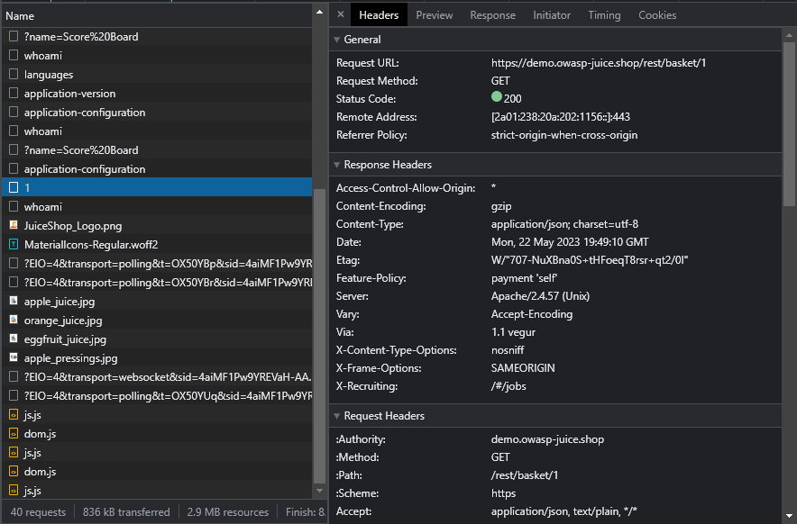
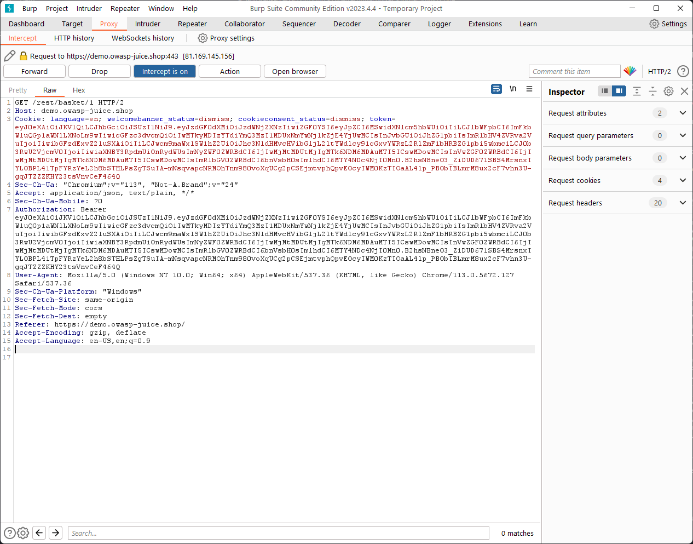
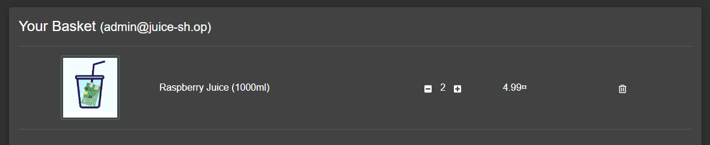

# 3. Faille dans le contrôle d'accès (Broken Access Control)

Accès à des fonctions dont on est pas sensé avoir accès dans l'application web.

## Exemple

Imaginez un blog où tout le monde peut écrire des articles.
Chacun peut écrire un article sur son compte dans le blog et personne ne peut éditer les articles
des autres.

Lorsque vous supprimez un de vos article, vous remarquez cette URL: `http://example.org/api/articles/delete?id=5`.

Cela veut dire plusieurs choses :
    - Chaque article doit avoir un ID unique ;
    - L'article que vous avez supprimé avait un ID de `5`.

Maintenant, vous vous demandez ce qu'il se passe si seulement on changeait cet ID dans l'URL !

Si il y a une faille dans le contrôle d'accès, cela vous permettrez de supprimer n'importe quel
article tant que vous donnez l'ID de celui-ci.

## Démonstration avec OWASP Juice Shop + Burp Suite

> On se servira de ce site internet pour notre démonstration, <https://demo.owasp-juice.shop/#/basket>.

Nous devons premièrement être identifié sur le compte administrateur. Pour faire cela, on va utiliser
[la même injection SQL que dans la partie précédente](./2-injection-sql.md) dans la démo.

Le but ici, est de récupérer le panier d'un autre utilisateur, juste pour s'amuser et/ou l'espionner.

Pour cela, on va se servir de [Burp Suite](../3-outils/3-burp-suite.md) pour intercepter la requête `/rest/basket/{id_utilisateur}`
que nous pouvons voir dans le DevTools lorsque la page se charge.

Le `1` à la fin de l'URL devrait correspondre à l'ID de l'utilisateur.
Pour vérifier sur quel ID nous sommes actuellement, on peut voir la réponse de la
requête un peu plus au dessus, `whoami` qui donne: `{ "id": 1, ... }`.

Pour vérifier cela, on va tout simplement essayer !

On allume l'intercepteur et on reload la page pour intercepter les requêtes dans Burp.

On `Forward` jusqu'à arriver sur notre requête `GET /rest/basket/1`.

On va tout simplement changer le `1` en `2` et voir ce qu'il se passe !

On `Forward` la requête et on désactive l'intercepteur pour automatiquement forward
toutes les autres requêtes.

Et ta-da ! Voici notre nouveau panier.
