# 3. Intercepter et modifier des requêtes avec Burp

Nous allons utiliser la suite d'outils **Burp Suite** pour la création d'un proxy qui va nous
permettre de répéter, intercepter et modifier des requêtes.

Nous pouvons faire bien plus avec ce logiciel mais nous allons rester simple ici et aller vers l'essentiel.

## Démarrage de Burp

Lorsqu'on démarre Burp, on fait un projet temporaire - sauf si l'on veut sauvegarder sa progression.

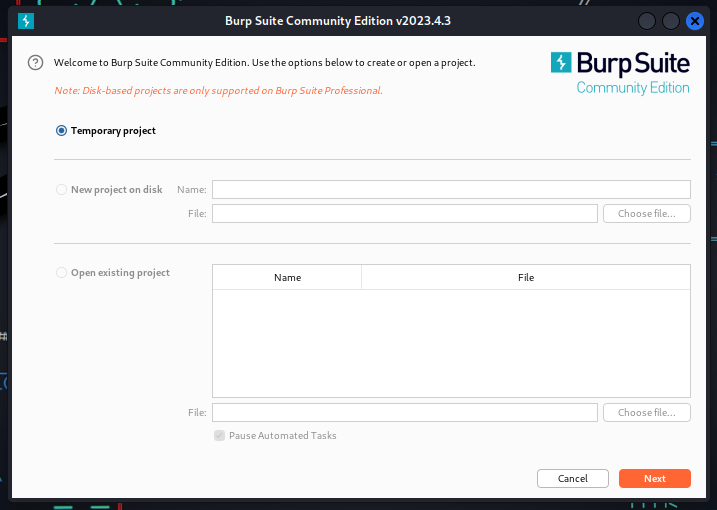

On utilise les paramètres par défaut et on démarre Burp.

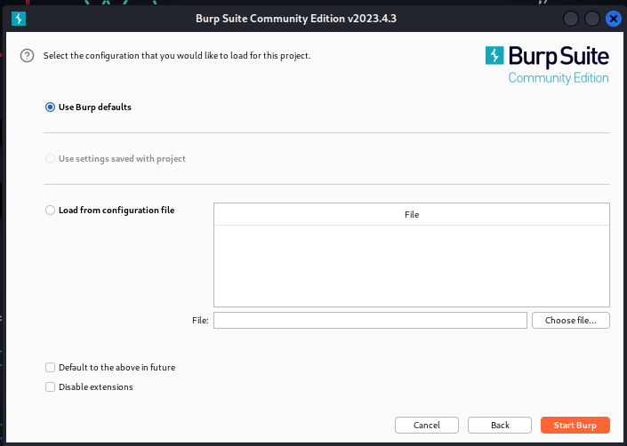

## Proxy

Nous allons nous intéresser à l'onglet `Proxy`.

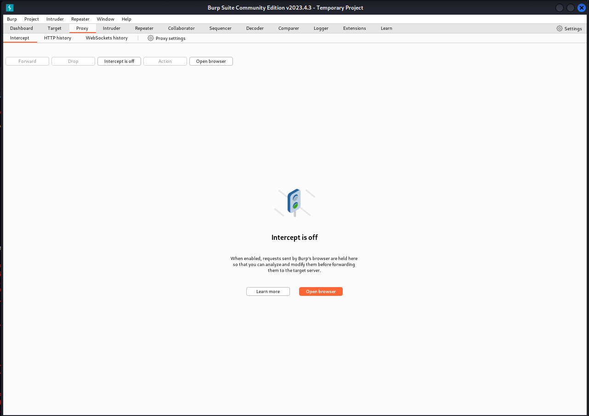

Nous pouvons voir que l'intercepteur est désactivé.

Pour l'activer vous pouvez tout simplement cliquer sur le bouton `Intercept is off`.
Le bouton sera activé et son texte deviendra `Intercept is on`.

### Configuration du Proxy pour Firefox

Rendez vous dans la configuration Réseau de Firefox  

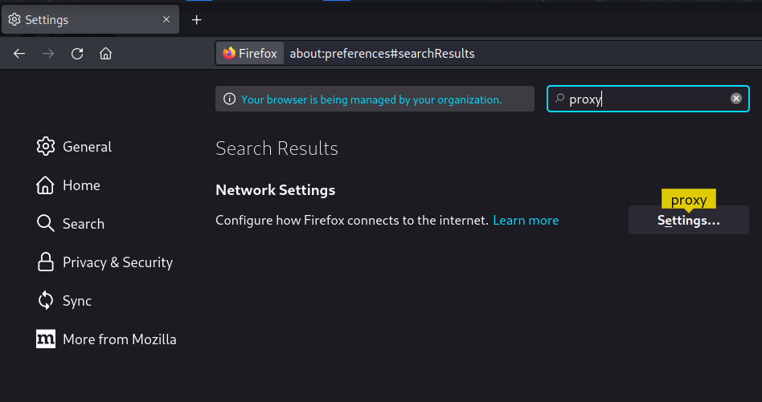

Nous allons ensuite définir un proxy manuel sur `127.0.0.1:8080` car, par défaut, l'intercepteur de Burp tourne sur le port `8080`.

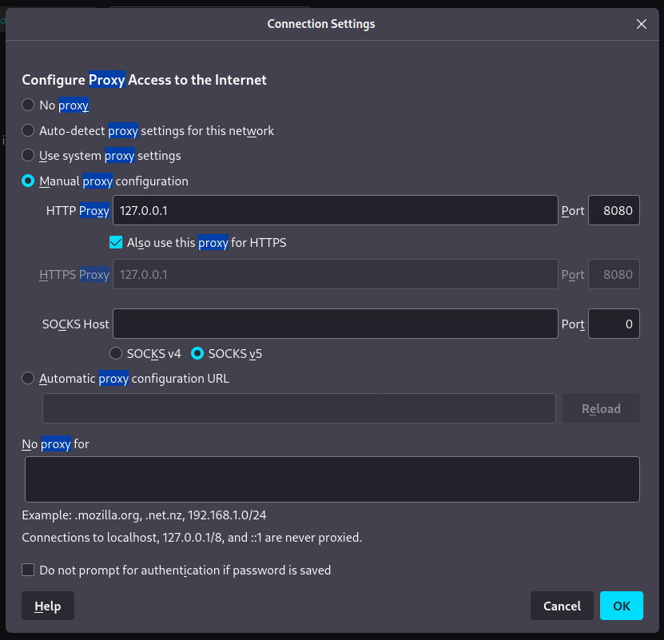

Maintenant nous allons télécharger le certificat Burp pour pouvoir accès à l'HTTPS avec le proxy.
Pour cela, rendez vous sur `http://burpsuite` et cliquez sur `CA Certificate` pour télécharger le certificat.

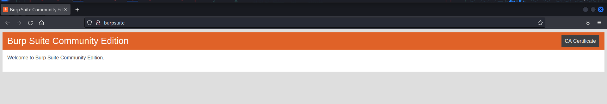

Rendez vous de nouveau dans la configuration de Firefox et cette fois-ci dans la partie Sécurité et Confidentialité pour voir les certificats actuellement installés.

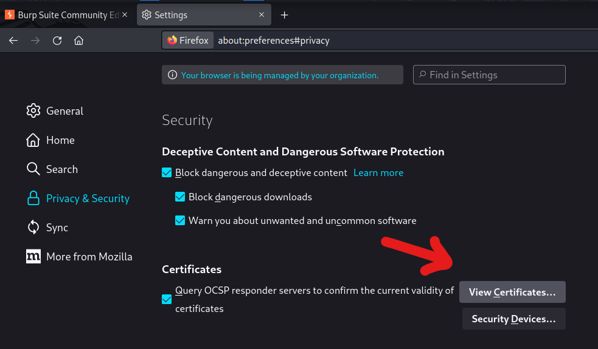

On importe enfin le certificat qu'on a téléchargé précédemment.

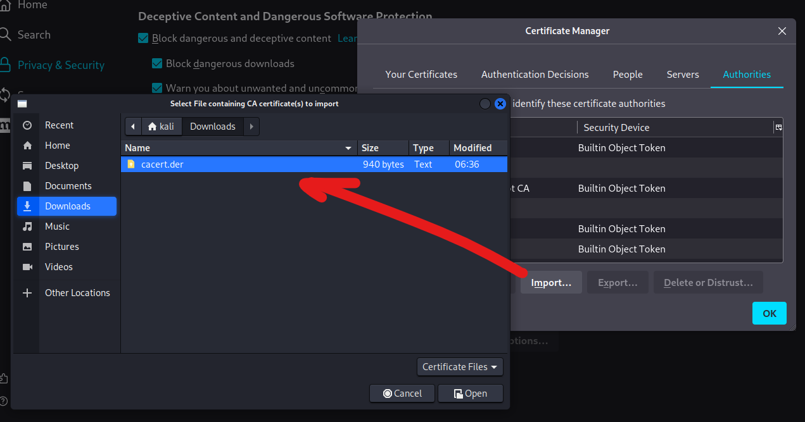

Puis on confirme en disant qu'on croit ce certificat.

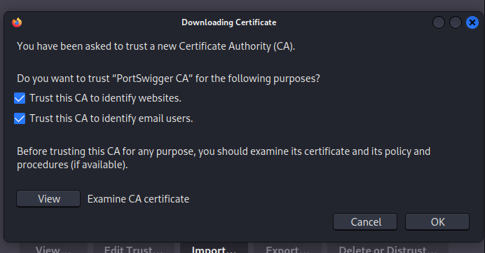

Tout est prêt maintenant !

### Utilisation du Proxy

Maintenant, à chaque requête envoyée, vous pourrez en voir son contenu/la modifier avant qu'elle soit envoyée.

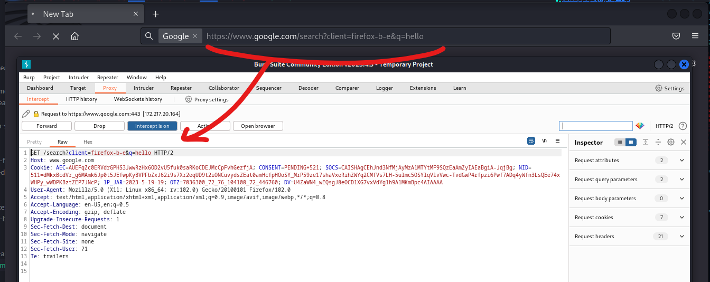

Ici, j'ai tout simplement fait une recherche Google: `hello`.

Je peux voir le contenu de ma requête dans Burp et modifier ce que je veux!

Pour l'exemple, je vais changer le paramètre `q` dans l'URL.

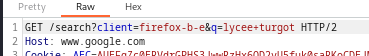

Maintenant je peux cliquer sur **Forward** !

> À noter que **Drop** "lâche" la requête: elle ne la fait pas.

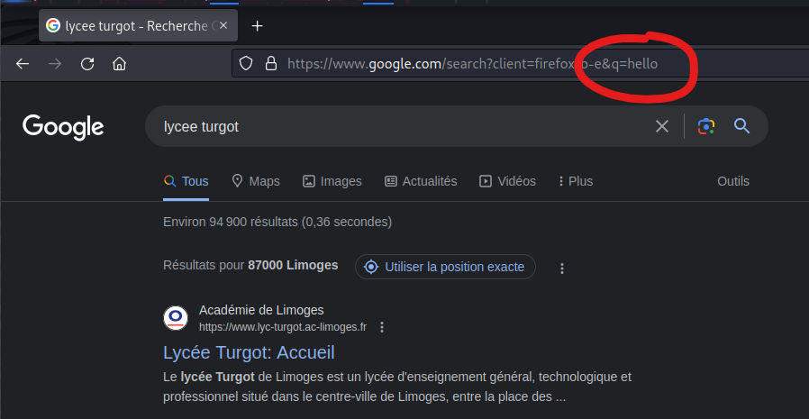

On peut voir que Google m'a retourné une recherche complètement différente de ce que j'avais initialement tapé
dans mon navigateur web.
