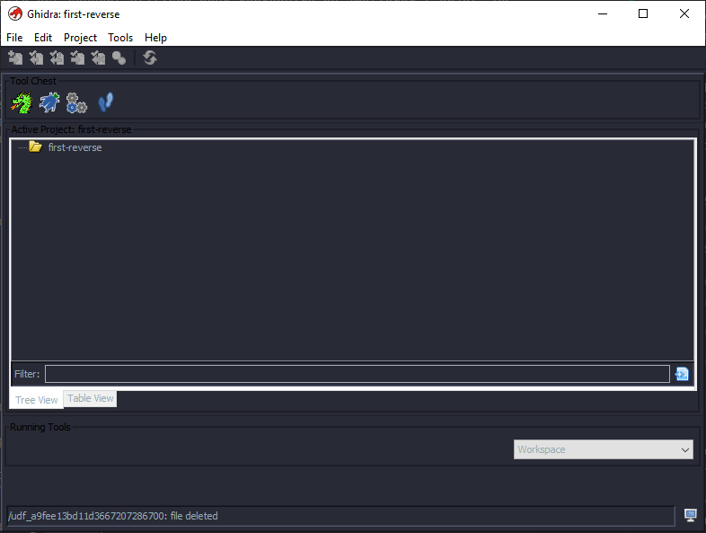
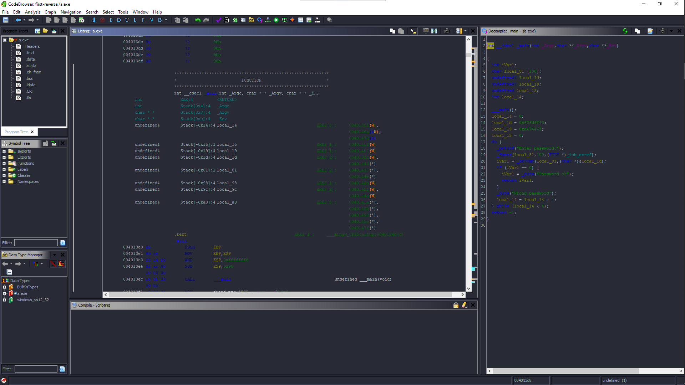

# 1. Reverse engineering

## Qu'est que le reverse engineering ?

La rétro-ingénierie (reverse engineering) est l'action de démonter un objet pour voir comment il fonctionne. Elle sert principalement à analyser et à acquérir des connaissances sur le fonctionnement d'un objet, mais elle est souvent utilisée pour reproduire ou améliorer l'objet. De nombreux éléments peuvent faire l'objet d'une rétro-ingénierie, notamment les logiciels, les machines physiques, la technologie militaire et même les fonctions biologiques liées au fonctionnement des gènes.

La pratique de la rétro-ingénierie appliquée aux logiciels s'inspire d'industries plus anciennes. La rétro-ingénierie des logiciels se concentre sur le code machine d'un programme, c'est-à-dire la chaîne de 0 et de 1 envoyée au processeur logique. Les énoncés du langage de programmation sont utilisés pour transformer le code machine en code source original.

## Les outils

Nous utiliserons Ghidra dans ce chapitre. Par la suite nous serons emmener à utiliser gdb, un autre outils de reverse-engineering.

### Ghidra

Nous allons utiliser Ghidra pour faire le reverse-engineering de `crackme.exe`.

Nous allons tout d'abord voir un concept qui nous sera utile par la suite.

En informatique, l'entier est un type de données qui est généralement représenté sur plusieurs octets. Le boutisme (endianness en anglais) désigne l'ordre dans lequel ces octets sont placés. Il existe deux conventions opposées : l'orientation gros-boutiste qui démarre avec les octets de poids forts, et l'orientation inverse petit-boutiste.

L'expression est utilisée de manière plus générale pour désigner l'ordre des chiffres dans un système de numération positionnel (par exemple celui des bits).

En effet, lors du reverse engineering suivant, il faudra convertir des entiers sous forme gros-boutiste en petit-boutiste.

Avant de nous lancer dans Ghidra, voyons d'abord ce que `crackme.exe` fait.

```console
$ .\crackme.exe
Enter password:passwd
Wrong password
Enter password:root
Wrong password
Enter password:admin
Wrong password
Enter password:sudo
Wrong password
```

C'est tout simplement un programme qui semble demander un mot de passe.

Nous pouvons donc maintenant démarrer Ghidra.



Nous pouvons glisser-déposer le fichier pour l'ingénierie inverse et cliquer sur "ok".  Nous attendons que Ghidra importe le fichier, puis nous cliquons sur "ok". Nous pouvons double-cliquer sur le fichier et nous y sommes.

Cliquez sur "yes" pour analyser, puis sur "analyse".

La fenêtre est divisée en plusieurs sous-fenêtres. Celles qui nous intéressent le plus sont `Listing` et `Decompile`



`Listing` est le code assembleur, le code exécuté par la machine.

`Decompile` est un code généré à partir du code d'assembleur. il peut ne pas être exactement le même que le code source.

Le code que nous pouvons voir n'est pas dépouillé (stripped). Le dépouillement d'un code supprime les noms de fonctions, etc... . Il peut s'agir d'une défense utile contre la rétro-ingénierie.

Nous regarderons dans la fenêtre de décompilation car le code ne semble pas être si difficile.

```C
int __cdecl _main(int _Argc,char **_Argv,char **_Env)

{
  int iVar1;
  char local_81 [100];
  undefined4 local_1d;
  undefined4 local_19;
  undefined local_15;
  int local_14;
  
  ___main();
  local_14 = 0;
  local_1d = 0x626d6f42;
  local_19 = 0xa474461;
  local_15 = 0;
  do {
    _printf("Enter password:");
    _fgets(local_81,100,(FILE *)_iob_exref);
    iVar1 = _strcmp(local_81,(char *)&local_1d);
    if (iVar1 == 0) {
      iVar1 = _puts("Password ok");
      return iVar1;
    }
    _puts("Wrong password");
    local_14 = local_14 + 1;
  } while (local_14 < 4);
  return -1;
```

Tout d'abord, nous pouvons voir que certaines variables sont définies puis qu'une valeur fixe leur est attribuée. Ensuite, il y a un `printf` qui demande le mot de passe et juste après une entrée de texte suivie d'une comparaison de chaînes de caractères. La fonction `_strcmp` compare l'entrée du mot de pass et une variable. `local_1d` semble donc être notre mot de passe. Mais il s'agit d'une représentation hexadécimale, nous devons donc convertir cette valeur en ASCII. Il existe de nombreux convertisseurs en ligne, choisissez donc le premier que vous voyez.

**626d6f42 -> bmoB**

Si nous revenons à la partie sur le boutisme, nous nous souvenons que certains nombres sont écris dans un ordre inversés. Si nous inversons les nombres par paires, nous obtenons `426f6d62` qui se transforme en `Bomb`. Cela semble mieux.

Nous pouvons essayer cela dans le programme.

```console
$ ./crackme.exe
Enter password:Bomb
Wrong password
Enter password:
```

Le mot de passe semble être erroné. Il faut donc revenir à Ghidra.

Si nous regardons de plus près, la variable `local_19` ne semble pas être utilisée mais elle a la même forme que local_1d. Si nous faisons la même chose avec local_19 et que nous enlevons le a, nous obtenons :

**614447 -> aDG**

Si nous combinons `Bomb` et `aDG`, nous pouvons réessayer à l'intérieur du terminal.

```console
$ ./crackme.exe
Enter password:BombaDG
Password ok
```

Voici donc votre première rétro-ingénierie.
