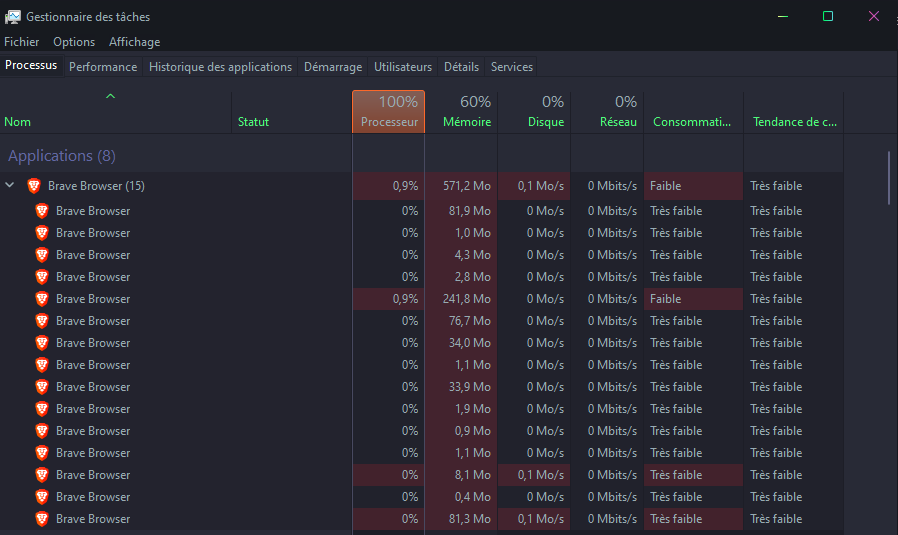
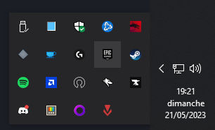

# 1. Processus

Un processus est une instance d'un executable / d'une application. C'est un conteneur comprenant tout ce qu'a besoin une application pour s'executer: le code, les données et la mémoire. Une application peut démarrer plusieurs processus (Figure 1.). Ce sont des processus enfants.

> 
> (Figure 1.)

Les processus ne connaissent pas les autres processus, ils pensent donc être les seul a utiliser la memoirs. Cela peut donc mener a des problèmes.

Il existe 3 types de processus:

- Application:

    Il démarre un programme spécifique (comme par exemple un navigateur). Ce sont les application visibles par l'utilisateur.  

- Arrière-plan:

    Ce sont les processus cachés à l'utilisateur (figure 2.) qui tourne en tache de fond. Ces processus peuvent aussi être des processus Application transformé en processus Arrière plan.

> 
> (Figure 2.)

- Windows:

    Il sont lancés automatiquement au démarrage et effectuent des tâches critiques comme par exemple la gestion de la mémoire, la sécurité, les drivers, etc...

Ces processus ont chacun une priorité qui défini le temps que le CPU accorde à ce processus.

Ces 6 niveaux priorités sont:

- Basse -> exécuté quand il n'y a plus aucune tache avec une niveau priorité supérieur
- Inférieur a la normal
- Normal -> priorité qu'un processus a par default
- Supérieur a la normal
- haute
- temps réelle -> accès exclusif au temps de CPU

Si la priorité est "temps réelle" le processus pourra être exécuté avant même les drivers de souris, clavier, etc... . cela peut donc être très dangereux.

C'est système de planification de windows qui gère cette organisation.

Le système d'exploitation donne au processus des informations tres utile:

- PID (Process IDentifier)
- le chemin d'accès a l'executable
- les argument(s) passé(s) pour démarrer le processus

Les processus utilisent du temps CPU donc plus il y a de processus démarré en même temps, plus l'ordinateur ou serveur sera lent.
