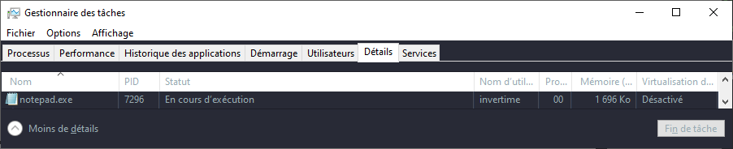
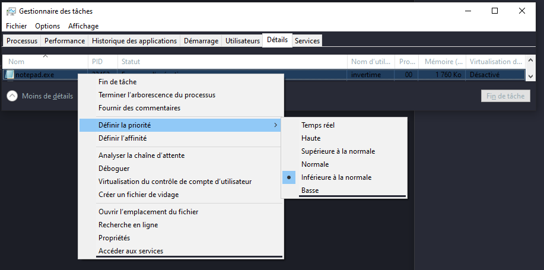

# 4. API Windows

Une API (Application Programming Interface) permet de faire communiquer deux programmes ensembles. Nous allons ici utiliser celle de windows pour lui communiquer.

Nous utiliserons beaucoup la [documentation](https://learn.microsoft.com/en-us/windows/win32/learnwin32/learn-to-program-for-windows) ainsi que le language C.

## Exemple d'utilisation avec une boite de message

En cherchant dans la documentation, nous pouvons trouver la fonction `MessageBoxW`. Les différentes versions sont différents encodage (ANSII, Unicode, ...) ainsi que des versions étendues

```c++
int MessageBoxW( 
 [in, optional] HWND hWnd,
 [in, optional] LPCTSTR lpText,
 [in, optional] LPCTSTR lpCaption,
 [in] UINT uType 
);
```

> *(la syntaxe est la même en C++ et en C)*

`[in, optional] HWND hWnd`

Type: **HWND** (Handle fenêtre)

Ce paramètre fait référence a un handle pour une fenêtre parente. Si il vaut **NULL**, la boite de message n'aura pas de fenêtre parent. (optionnel)

`[in, optional] LPCTSTR lpText`

Type: **LPCTSTR** (Chaîne de caractère Unicode)

C'est le message qu'on veut afficher dans la boite. (optionnel)

`[in, optional] LPCTSTR lpCaption`

Type: **LPCTSTR** (Chaîne de caractère Unicode)

C'est le titre de la boite de message. (optionnel)

`[in] UINT uType`

Type: **UINT** (Entier non signé ou positif)

Il faut spécifié le contenu des boutons parais une liste.


### Implementation

```C
#include <windows.h> // importe l'api windows

int main(void) { 

    MessageBoxW(
        NULL,                               // On ne veut pas de fenêtre parent
        L"My message box",                  // le contenu
        L"Hello world!",                    // le titre
        MB_YESNOCANCEL | MB_ICONWARNING     // une boite de type "oui, non ou annuler" ainsi qu'une icône de panneau "attention"
    );
    
    return EXIT_SUCCESS; // pour quitter sans erreur
}
```

## Exemple de création de processus

En cherchant dans la documentation, nous pouvons trouver la fonction `CreateProcessW`.

```c++
BOOL CreateProcessW( 
 [in, optional] LPCSTR lpApplicationName,
 [in, out, optional] LPSTR lpCommandLine,
 [in, optional] LPSECURITY_ATTRIBUTES lpProcessAttributes,
 [in, optional] LPSECURITY_ATTRIBUTES lpThreadAttributes,
 [in] BOOL bInheritHandles,
 [in] DWORD dwCreationFlags,
 [in, optional] LPVOID lpEnvironment,
 [in, optional] LPCSTR lpCurrentDirectory,
 [in] LPSTARTUPINFOA lpStartupInfo,
 [out] LPPROCESS_INFORMATION lpProcessInformation 
);
```

Il y a beaucoup plus de paramètres a gérer ici. Nous le détaillons donc dans le code pour ne pas se perdre.

### Implementation

```C
#include <stdio.h> // import pour afficher du texte dans la console
#include <Windows.h> // import l'api windows

int main(void) {

STARTUPINFO startupinfo = {0};                          // Nous devons les créer d'abord et
PROCESS_INFORMATION processinformation = {0};           // ensuite elle seront remplie par la fonction

    if (!CreateProcessW(
        L"C:\\Windows\\System32\\notepad.exe", // chemin de l'executable
        NULL, // pas d'arguments au départ
        NULL, // pas important pour nous
        NULL, // pas important pour nous
        FALSE, // pas important pour nous
        BELOW_NORMAL_PRIORITY_CLASS,
        NULL, // pas important pour nous
        NULL, // pas important pour nous
        &startupinfo, // pointeur vers startupinfo
        &processinformation // pointeur vers processinformation

    )){
        printf("(-) failed to create process, error: %ld", GetLastError()); // dans la documentation de l'api windows, GetLastError recupérer le code d'erreur de dernier thread.
        return EXIT_FAILURE; // retourne une erreur car la creation d'un  processus a échoué
    }

    printf("(+) process started! pid:%ld", processinformation.dwProcessId); // affiche le PID du processus que nous venons de créer

    return EXIT_SUCCESS;
}
```

Nous pouvons maintenant vérifier que ça fonctionne en executant le programme puis en utilisant le gestionnaire de tâches.

```console
$ createProcess.c

(+) process started! pid:7296
```




Nous savons maintenant comment cela fonctionne.
