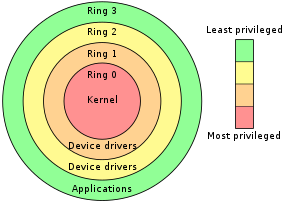

# Exploitation de windows

Apres avoir vu comment fonctionné windows nous devons maintenant voir comment l'exploiter. Il existe plusieurs types d'attaques réalisables.

- Injection de shellcode:

Un shellcode est une chaîne de caractères qui représente un code binaire exécutable. À l'origine destiné à lancer un shell ('/bin/sh' sous Unix ou command.com sous DOS et Microsoft Windows par exemple), le mot a évolué pour désigner tout code malveillant qui détourne un programme de son exécution normale.

Une injection de shell code revient donc a executer un shellcode derriere l'apparence d'une application bénines, comme par exemple le bloc-note vu précédemment.

- Injection de DLL:

Une injection DLL (DLL injection) ou injection de DLL est une technique utilisée pour exécuter du code dans l'espace d'adressage d'un autre processus en l'obligeant à charger une bibliothèque de liens dynamiques. Autrement dit, il se fait passer pour une librairie dynamique pour remplacer ses fonctions. L'injection DLL est souvent utilisée pour influer sur le comportement d'un autre programme d'une manière que ses programmeurs n'avait pas prévue.

- Injection de NTDLL:

Les NTDLL sont des equivalent aux DLL qui fonctionne en `Kernel mode`.
Dans l'architecture x86, il y a 4 anneaux, appelés "anneaux de privilège/protection", qui sont responsables de l'accès à la mémoire et aux fonctionnalités du processeur. Ils sont généralement ordonnés de manière hiérarchique, de 0 à 3, où plus on est bas (c'est-à-dire l'anneau 0), plus on a d'accès/de privilèges.

Windows utilise les anneaux 0 et 3.
- Anneau 0 : Il est utilisé par le noyau et les pilotes de périphériques. Il est appelé `MODE KERNEL`.

- Anneau 3 : Il est utilisé par les applications de niveau utilisateur. C'est l'anneau le moins privilégié ; des applications telles que les navigateurs web, les traitements de texte, etc... utilisent cet anneau. L'accès aux ressources du système est limité et les fonctions critiques du système ne sont pas accessibles. Il est appelé `MODE UTILISATEUR`.

Les NTDLL sont des dll opérant a l'anneau 0. Ils possèdent donc plus de droits.

- Appels systèmes direct

En passant par des appels systèmes direct, nous passons outre les sécurités de l'api win32. Cela nous permet d'avoir plus de contrôle sur notre malware mais il devient beaucoup plus complexe a écrire.
